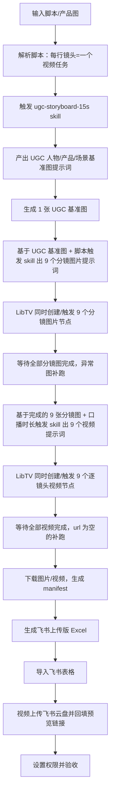

# 灵芝茶逐镜头图片视频飞书交付 Loop

这个 loop 用来把「输入脚本」稳定沉淀成「UGC基准图 + 9张分镜图 + 9个逐镜头视频 + 飞书交付表格」。

核心原则：

- 脚本驱动出视频：脚本是唯一主线，图和视频都只是脚本的可视化执行。
- 一个镜头一个视频，不合成整条。
- 口播原文不改写，只改视频节点时长和口播节奏提示。
- 视频节点的真实时长必须改模型参数 `duration`，不能只写在提示词里。
- 先有 UGC 人物/产品/场景基准图，再基于基准图出分镜图片提示词。
- 分镜图是第一轮批量并发；全部分镜图完成后，才触发视频提示词。
- 视频是第二轮批量并发；不要一个镜头手工跑完再跑下一个。
- 图片和视频都先落本地 manifest，再生成 Excel，再导入飞书。
- 视频不要用 LibTV 原始 mp4 直链做交付链接，因为点击容易下载；要上传到飞书云盘后，用飞书 file 预览页链接回填表格。
- 小云雀 API Key 形如 `ak-rr__...`，不是火山方舟 Key；必须走小云雀接口，不要提交到 Ark。

## 目录结构

```text
loops/lingzhi_tea_storyboard_video_loop/
  README.md
  config.script01.json
  scripts/storyboard_video_feishu_loop.py
  scripts/run_antioxidant_two_batch.py
  scripts/trigger_missing_videos.py
  scripts/rebuild_missing_videos_fast.py
  scripts/deliver_ready_to_feishu.py
  scripts/upload_videos_to_feishu_preview.py
  scripts/run_xiaoyunque_video.py
  scripts/organize_libtv_canvas.py
```

输出目录沿用项目流程：

```text
outputs/灵芝茶24组_分镜图片视频流程/
  04_逐镜头视频图片下载/脚本01/
    images/
    videos/
    脚本01_视频图片_manifest.json
  05_带视频图片表格/脚本01/
    脚本01_拍摄脚本分镜_1_飞书上传版.xlsx
    script01_feishu_video_drive_uploads.json
```

## LibTV 画布整理规则

当前 LibTV 项目：

```text
项目名：灵芝茶24组全量分镜视频_0622
projectUuid：4bc1c28bb3754d8ca3521aa6df975130
```

画布太卡时，先跑整理脚本，不要手工乱删节点：

```powershell
py scripts/organize_libtv_canvas.py
```

整理脚本只做这些事：

```text
1. 创建或更新 00_总控_当前工作台_0629
2. 创建 00_状态看板_不要删，写清交付状态和剩余任务
3. 创建以下清单组：
   01_待处理_LibTV卡算力_脚本20-23
   02_已交付_LibTV批量组
   03_外部补跑_小云雀
   90_历史单独分镜图_归档
   04_流程固定入口
4. 每个清单组里放一个文本清单，说明该看哪些原始组
```

注意：LibTV 当前不允许“组里嵌套旧组”，所以整理方式是“总控看板 + 清单指针”，不是把所有旧组物理塞进一个大文件夹。不要为了看起来干净去删除旧组；旧组 ID 仍被状态文件和交付脚本引用。

当前入口含义：

```text
00_总控_当前工作台_0629
  先看这里，里面有当前状态、交付规则、剩余任务。

01_待处理_LibTV卡算力_脚本20-23
  只盯这四个：script20_loop_0623、script21_loop_0623、script22_loop_0623、script23_loop_0623。

02_已交付_LibTV批量组
  抗氧化1、抗氧化4、脚本02-19、脚本06。默认不要动，除非返修。

03_外部补跑_小云雀
  脚本24已用小云雀补跑交付，LibTV里0/9不代表交付缺失。

90_历史单独分镜图_归档
  旧的“脚本XX_单独分镜图”组，只作为历史素材，不作为主流程入口。
```

## 正确主流程



## 小云雀视频补跑分支

当 LibTV 返回 `1200000136 算力不足`，或用户明确提供小云雀 API Key 补跑视频时，视频阶段可以切到小云雀接口。

适用条件：

```text
分镜图已经全部完成
每个镜头都有本地或远端分镜图
只缺视频
用户提供的小云雀 key 形如 ak-rr__...
```

执行规则：

```text
1. 不把 key 写进工程文件、状态文件或 README，只从环境变量 XIAOYUNQUE_API_KEY 读取。
2. 先下载每个镜头分镜图到脚本交付目录 images/。
3. 调用小云雀 upload_file，把每张分镜图上传成 pippit_asset_id。
4. 一个镜头提交一个 submit_marketing_run。
5. general_agent_settings 必须包含：
   ratio = 3
   video_model = seedance2.0_fast_vision
   duration_start = duration_end = 当前镜头真实时长
   show_subtitle = false
   resolution = 480p
6. 轮询 query_generate_video_result，成功后立刻下载 mp4 到 videos/。
7. 写回主状态 external_video_provider / external_video_path。
8. 继续走原飞书交付流程：生成脚本单独表格、上传视频到飞书云盘、回填 file 预览链接。
```

命令入口：

```powershell
$env:XIAOYUNQUE_API_KEY = "<只在当前终端临时设置>"
py scripts/run_xiaoyunque_video.py script24
py scripts/deliver_ready_to_feishu.py script24
py scripts/upload_videos_to_feishu_preview.py script24
```

注意：

- 小云雀文档里写过 `video_resolution`，但实际接口会要求 `resolution`；当前脚本同时兼容写入 `resolution=480p`。
- 交付表格里的视频链接仍然必须是飞书 file 预览链接，不能用小云雀或 LibTV 的 mp4 直链。
- 小云雀输出是营销视频接口，提示词必须明确“只生成当前一个镜头、不要字幕、口播原文不可改写、动作和运镜匹配脚本”。

## 脚本驱动原则

这个 loop 的目标不是“根据图片做视频”，而是“根据脚本出视频”。图片只是中间参考层，不能改变脚本。

脚本行是每个镜头的源数据：

```text
脚本行 -> 分镜图片提示词 -> 分镜图 -> 视频提示词 -> 单镜头视频 -> 飞书交付行
```

每一行脚本必须继承到最终视频：

```text
镜头编号：决定输出文件名、节点名、飞书行号
原始时长：作为参考
生成时长：根据口播重新校准
景别：决定画面距离
运镜：决定视频镜头运动
内容描述：决定画面动作
口播：逐字进入视频提示词，不改写
音乐/备注：进入交付表格，必要时影响氛围
```

禁止反向污染脚本：

- 不能因为图里多了某个元素，就改脚本动作。
- 不能因为视频模型说不完，就缩写口播。
- 不能因为产品图好看，就把对比镜头也变成本品。
- 不能把一个总视频提示词拆成镜头，必须每个镜头从脚本行独立生成。

正确的单镜头映射：

```text
Excel 镜头2：
  景别：近景俯拍
  内容：拆开劣质茶包，将碎渣倒在白纸上
  口播：之前踩过太多坑...

输出：
  镜头2分镜图：劣质茶包碎渣俯拍，不出现本品包装
  镜头2视频提示词：拆开、倒出、停在碎渣特写，9秒完整说完口播
  镜头2视频：一个独立 mp4
  飞书第2行：该镜头图片和视频预览链接
```

### 阶段 1：输入脚本触发 skill

输入可以是原始口播、脚本 Excel、产品图和项目要求。

先解析脚本，而不是先想画面。解析结果至少要得到：

```text
脚本编号
脚本标题
镜头总数
每个镜头的景别、运镜、内容描述、口播
每个镜头是否出现本品
每个镜头是否为对比/踩坑/竞品/劣质样本
每个镜头建议生成时长
```

再触发 `ugc-storyboard-15s` skill。这个 skill 的第一目标不是直接跑9张图，而是先锁定：

```text
人物是谁：年龄、脸型、发型、妆容、穿搭、表情气质
产品怎么出现：包装形状、颜色、标签位置、原有印刷文字
场景在哪里：居家桌面、客厅、厨房、办公室等
光线风格：真实UGC、手机手持、柔和自然光
短视频调性：真实分享，不是硬广摆拍
```

本阶段产物：

```text
1 张 UGC 人物/产品/场景基准图
1 份基准图说明 JSON / prompt
```

验收：

- 人物形象适合脚本人设。
- 产品包装没有漂移。
- 场景后续能承接 9 个镜头动作。
- 不要把基准图做成广告海报或产品精修图。

### 阶段 2：基于 UGC 基准图出分镜图片提示词

当 UGC 基准图通过后，再把它作为一致性参考，结合脚本每个镜头，让 skill 输出 9 个分镜图片提示词。

分镜图片提示词必须从脚本行生成，不允许只按通用 9 宫格节奏自由发挥。

每条分镜图片提示词必须包含：

```text
9:16竖屏
镜头编号
景别
机位/角度
主体动作
表情
场景
光线
UGC手机拍摄感
同一人物一致性
产品一致性或“本镜头不出现本品”的说明
```

注意：

- 图片提示词不写“不要字幕”这类负向文字，避免影响包装文字。
- 如果是踩坑/对比镜头，要明确“其他劣质茶包/碎渣茶包”，不要引用本品包装。
- 分镜图提示词只负责静态画面，不负责视频运镜。

本阶段产物：

```text
9 条分镜图片 prompt
9 个图片节点配置
```

### 阶段 3：同时跑全部分镜图

9 个分镜图节点创建完成后，直接并发触发：

```text
镜头1图片节点 run
镜头2图片节点 run
...
镜头9图片节点 run
```

不要一个镜头验完再手动跑下一个。正确做法是：

1. 同时触发全部图片节点。
2. 轮询全部图片节点状态。
3. 全部完成后集中检查。
4. 只重跑不合格的图片。

图片验收重点：

- 镜头内容是否对脚本。
- 人物是否同一个人。
- 产品是否该出现、是否正确。
- 镜头2这类对比镜头是否没有误用本品。
- 画面没有奇怪文字、字幕、广告贴片。
- URL 不为空。

只有当 9 张分镜图全部可用后，才进入视频提示词阶段。

### 阶段 4：全部分镜图完成后触发 skill 出视频提示词

视频提示词不能在分镜图未完成前就写死，因为视频必须看实际图来匹配：

```text
人物姿态
手里拿的东西
产品位置
桌面元素
镜头可运动方向
动作起点和终点
```

触发 skill 时输入：

```text
原始脚本/Excel
9 张已完成分镜图
每个镜头口播原文
每个镜头目标 duration
不要字幕
动作匹配
运镜匹配
一个镜头一个视频
```

输出是 9 条逐镜头视频提示词，不是一个 15 秒总视频提示词。

视频提示词生成时，优先级是：

```text
脚本口播 > 脚本动作 > 脚本景别/运镜 > 当前分镜图实际画面 > UGC基准一致性 > 模型美化
```

每条视频提示词必须包含：

```text
基于左侧当前分镜图生成一个独立镜头视频
动作匹配
运镜匹配
口播原文，不可改写
口播时间，本镜头约 X 秒完整自然说完
字幕强约束
身份/产品/环境不漂移
```

### 阶段 5：同时跑全部视频

视频节点全部准备好后，直接并发触发：

```text
镜头1视频节点 run
镜头2视频节点 run
...
镜头9视频节点 run
```

如果用户要求“除了第一个镜头”，则并发触发 2-9。

触发后进入轮询：

```text
loading=true, status=1       生成中
loading=false, status=2, urlCount=1   成功
loading=false, status=2, urlCount=0   失败，补跑
```

不要因为 `libtv node -r` 超时就判定失败，先读节点状态。

### 阶段 6：下载、表格、飞书交付

全部视频可用后统一下载：

```text
9 张分镜图
9 个逐镜头视频
1 个 manifest
1 个飞书上传版 Excel
1 个飞书表格
9 个飞书云盘视频文件
```

飞书交付要求：

- 表格由 Excel 直接导入飞书，保留图片缩略图和排版。
- `查看分镜图` 可以链接 LibTV 图片 URL。
- `查看视频` 必须链接飞书云盘 file URL，不能链接 LibTV mp4 直链。
- 表格和视频文件都设置组织内有链接可查看。

## 单个分镜的完整流程

下面是「一个镜头 / 一个分镜」的最小闭环。注意它嵌在上面的批量 loop 里：图片阶段并发跑全部镜头，视频阶段也并发跑全部镜头；单镜头流程主要用于定义每个节点的输入、输出和验收。

### 0. 单镜头输入

每个镜头至少需要这些输入：

```text
脚本编号：脚本01
镜头编号：镜头02
原始时长：2~3S
景别：近景俯拍
运镜：按短视频UGC拍摄逻辑执行...
内容描述：拆开劣质茶包，将碎渣倒在白纸上...
口播原文：之前踩过太多坑...
图片节点ID：efad5e13-...
视频节点ID：f283aacd-...
目标视频时长：9秒
```

单镜头禁止做的事：

- 不改写口播原文。
- 不把多个镜头合成一个视频。
- 不把视频字幕写进画面。
- 不只在提示词里写时长，必须改 LibTV 模型参数 `duration`。
- 不用 LibTV mp4 原始直链作为最终飞书视频交付链接。

### 1. 从 Excel 取镜头信息

读取脚本 Excel 的一行，确认这些列：

```text
镜头 / 时长 / 景别 / 运镜 / 内容描述 / 口播 / 音乐 / 备注
```

操作判断：

- 如果口播很短，`duration` 可保持 4-5 秒。
- 如果口播明显超过原始分镜时长，需要加长生成时长。
- 原始 Excel 里的 `2~3S` 可以保留为参考，但生成用的真实时长写到新增列 `生成时长(秒)`。

脚本01当前口播校准结果：

```text
镜头1: 6s
镜头2: 9s
镜头3: 4s
镜头4: 5s
镜头5: 8s
镜头6: 4s
镜头7: 4s
镜头8: 6s
镜头9: 4s
```

### 2. 生成或确认分镜图节点

每个镜头必须有且只有一个主分镜图节点。

检查项：

- 图像是否对应当前镜头内容。
- 角色、衣服、场景是否和整组一致。
- 产品是否该出现；如果是对比/踩坑镜头，不要误用本品。
- 画面里不要加字幕、标题、贴纸文案。
- 图片 URL 是否存在。

镜头2这次的教训：

```text
镜头2是“其他劣质灵芝茶 / 碎渣茶包”对比镜头，
不能连接本品包装参考。
如果图里出现我们的产品，就要删掉产品参考后重跑图片。
```

单镜头图片通过后，manifest 里要记录：

```json
{
  "shot": 2,
  "imageNode": "efad5e13-...",
  "imageUrl": "https://libtv-res...png"
}
```

### 3. 创建或更新视频节点

每个镜头对应一个 LibTV `video` 节点，模式用：

```text
modeType = singleImage2video
model = Seedance 2.0 VIP
ratio = 9:16
resolution = 480p
count = 1
enableSound = on
```

视频节点必须左连当前镜头图片节点：

```powershell
libtv node -p <project_uuid> <video_node_id> --left <image_node_id>
```

不要手写 `imageList`。LibTV 会根据左连接刷新素材列表，直接写 `imageList` 容易被校验拒绝或不生效。

### 4. 写单镜头视频提示词

提示词结构固定成 6 段：

```text
基础画幅与一致性：
9:16竖屏，真实UGC短视频，手机手持拍摄感，基于左侧分镜图生成一个独立镜头视频...

动作匹配：
本镜头人物/手部/产品具体做什么。

运镜匹配：
镜头怎么跟随动作移动，不做无意义缩放。

口播原文：
逐字放入 Excel 口播，明确不可改写。

口播时间：
本镜头约 X 秒，完整自然说完这句；动作节奏如何覆盖口播。

字幕强约束：
画面绝对不要出现字幕、台词文字、标题、角标、贴纸文案、水印等。
```

推荐口播写法：

```text
口播原文（不可改写、不可扩写、不可换词）：<Excel原文>

口播时间：本镜头约X秒，必须完整自然说完这句原文；
动作A覆盖前半句，动作B覆盖后半句，语速自然。
口播必须和动作节奏匹配，不要为了说完而加速嘴型，不要出现说不完、嘴型乱跳或无声张嘴。
```

禁止再出现这类旧提示：

```text
如果当前镜头时长不足以完整说完原文，只表现人物正在自然说这句中的一段
```

因为这会导致口播和时间对不上。

### 5. 改真实视频时长

真实时长要改模型参数：

```powershell
libtv node -p <project_uuid> <video_node_id> -s duration=9
```

错误写法：

```powershell
libtv node -p <project_uuid> <video_node_id> -s settings.duration=9
```

原因：LibTV 模型 schema 里字段名是 `duration`，它会自动写进 `params.settings.duration`。

改完必须读回确认：

```powershell
libtv node -p <project_uuid> <video_node_id>
```

检查：

```text
data.params.settings.duration == 目标秒数
prompt 里没有“只说一段”等旧提示
imageList[0].nodeId == 当前镜头图片节点ID
```

### 6. 触发单镜头视频生成

```powershell
libtv node -p <project_uuid> <video_node_id> -r
```

注意：

- 命令可能 120 秒超时，但任务可能已经提交成功。
- 超时后不要立刻重复跑，先读状态。

状态检查：

```text
loading=true, status=1, progress=xx   生成中
loading=false, status=2, progress=100, urlCount=1   成功
loading=false, status=2, progress=100, urlCount=0   失败，必须补跑
```

单镜头成功标准：

```text
urlCount = 1
视频 URL 非空
duration 参数仍是目标秒数
taskId 已更新
```

### 7. 下载单镜头媒体

下载命名规则：

```text
04_逐镜头视频图片下载/脚本01/images/脚本01_镜头02_分镜图.png
04_逐镜头视频图片下载/脚本01/videos/脚本01_镜头02_视频.mp4
```

manifest 需要补齐本地路径：

```json
{
  "shot": 2,
  "imageUrl": "https://libtv-res...png",
  "videoUrl": "https://libtv-res...mp4",
  "imagePath": ".../脚本01_镜头02_分镜图.png",
  "videoPath": ".../脚本01_镜头02_视频.mp4",
  "durationSetting": 9,
  "taskId": "202606..."
}
```

### 8. 写入 Excel 行

在当前镜头所在行追加这些列：

```text
生成时长(秒)
分镜图
分镜图链接
视频链接
视频任务ID
```

要求：

- `分镜图` 列嵌入缩略图。
- `分镜图链接` 显示为 `查看分镜图`。
- `视频链接` 先可以显示为 `查看视频`，但最终必须换成飞书 file 预览页。
- 不写任何本地路径给交付方。

### 9. 上传单镜头视频到飞书云盘

不要把 LibTV mp4 URL 直接交付，否则点击常常变下载。

正确流程：

```powershell
lark-cli drive +upload --file ".\脚本01_镜头02_视频.mp4" --name "脚本01_镜头02_视频.mp4" --as user --format json
```

返回：

```json
{
  "file_token": "CwoHbsrXkoDPowxGlZPcleA7n7c",
  "url": "https://ucnscwivbsrz.feishu.cn/file/CwoHbsrXkoDPowxGlZPcleA7n7c"
}
```

把 Excel/飞书表格的视频链接改为这个飞书 file URL。

### 10. 设置权限

表格和每个视频文件都设置：

```json
{
  "link_share_entity": "tenant_readable",
  "share_entity": "same_tenant",
  "security_entity": "anyone_can_view"
}
```

注意：给 `lark-cli drive permission.public patch` 传 JSON 文件时要 UTF-8 无 BOM，否则可能报：

```text
--params invalid format, expected JSON object
```

### 11. 单镜头验收

一个镜头交付合格，必须同时满足：

- 飞书表格该行有脚本原文、内容描述、口播。
- 分镜图能看到。
- `查看分镜图` 能打开图片。
- `查看视频` 打开的是飞书 file 预览页，不是浏览器直接下载。
- 飞书 file 页面能播放视频。
- 同事有权限查看。
- 视频没有字幕。
- 视频动作和运镜匹配该镜头内容。
- 视频口播时长和镜头时长基本匹配。

## 单镜头状态表

每个镜头建议维护这几个状态，方便批量任务不断点：

```text
image_ready        图片已生成且内容正确
video_node_ready   视频节点左连正确，prompt 正确，duration 正确
video_running      已触发生成
video_ready        urlCount=1
media_downloaded   图片/视频已下载到本地
xlsx_ready         Excel 行已写好
drive_uploaded     视频已上传飞书云盘
sheet_link_patched 飞书表格视频链接已替换为 file 预览页
permission_ready   表格和视频权限已设置
accepted           人工验收通过
```

建议不要只看 `status=2`，一定要看 `urlCount`。

## 一键脚本

在工具矩阵根目录运行：

```powershell
python .\loops\lingzhi_tea_storyboard_video_loop\scripts\storyboard_video_feishu_loop.py `
  --config .\loops\lingzhi_tea_storyboard_video_loop\config.script01.json `
  --steps collect,download,xlsx,import,upload-videos,patch-links,permissions,verify
```

如果视频已经上传过，只想重新把飞书视频预览链接写回表格：

```powershell
python .\loops\lingzhi_tea_storyboard_video_loop\scripts\storyboard_video_feishu_loop.py `
  --config .\loops\lingzhi_tea_storyboard_video_loop\config.script01.json `
  --spreadsheet-token <飞书表格token> `
  --steps patch-links,permissions,verify
```

### 本批量任务快捷入口

本次 24 条和抗氧化脚本的批量状态保存在：

```text
outputs/批量脚本视频任务_0623/antioxidant_two_run_state.json
```

交付规则：
- 一个脚本一个飞书表格链接。
- 表格内容必须是中文。
- `查看视频` 必须是飞书 `file` 预览链接，不能是 LibTV mp4 直链。
- 已完成脚本先交付；缺视频脚本等算力恢复后补跑。

常用命令：

```powershell
# 1. 把已完整的脚本下载图片/视频、生成 Excel、导入飞书表格
python .\loops\lingzhi_tea_storyboard_video_loop\scripts\deliver_ready_to_feishu.py antioxidant1 antioxidant4

# 2. 把本地 mp4 上传飞书云盘，并回填表格里的“查看视频”为 file 预览链接
python .\loops\lingzhi_tea_storyboard_video_loop\scripts\upload_videos_to_feishu_preview.py script02 script03 script04

# 3. 对缺口视频节点重新触发；遇到算力不足则停止空转，等恢复后再跑
python .\loops\lingzhi_tea_storyboard_video_loop\scripts\trigger_missing_videos.py
```

## 常见坑

- `libtv node -s settings.duration=9` 是错的，会被校验拒绝；应该用 `-s duration=9`。
- 本批次交付视频统一用 `resolution=480p`；不要回退到 720p。
- `-r` 触发生成可能超时，但任务可能已经进入队列；超时后先查节点状态，不要盲目重复跑。
- 如果触发返回 `1200000136 算力不足`，不要反复空转重试。先记录缺口镜头，交付已完成脚本；等算力恢复后对缺口镜头重建或重新触发视频节点。
- `status=2, progress=100, url=[]` 不是成功交付，必须补跑。
- PowerShell 中文路径和 JSON 容易产生编码问题；脚本内部统一用 Python 写 UTF-8 无 BOM JSON。
- 飞书表格里直接放 mp4 原始 URL 容易下载；要上传视频到飞书 Drive，再写入飞书 file 链接。
- Excel 被打开时不能原地保存；脚本会另存 `*_飞书上传版.xlsx`。
- 不能凭文件名或历史项目猜产品。每次跑前必须确认本次产品全名和参考图。例如“灵芝黄芪枸杞茶”不能误用“五芝茶”外包装。
- 不要假设脚本有 9 或 10 个镜头。必须读取 Excel 到最后一行，按实际镜头数跑；本次 `抗氧化-4` 实际是 13 个镜头。
- `libtv group` 命令不稳定支持 `-p` 项目参数，容易打到当前目录默认绑定项目。操作 group 前必须先 `libtv project use <project_uuid>`，再查询 group 确认 child nodes。
- 上传资源后不要只看 upload 返回成功，必须查询 group 确认资源节点真的挂进目标组；必要时再用 `libtv group <group_id> --node <node_id>` 绑定。
- 不要用 PowerShell 内联中文长 prompt 调 LibTV。中文可能在写文件或参数传递时变成 `????`。所有中文 prompt 必须由 UTF-8 Python 脚本生成并直接调用 CLI，或先读回节点确认 prompt 没乱码。
- 即使用 UTF-8 Python 调 LibTV CLI，Windows/Node 参数链路仍可能把局部中文变成 mojibake。生产级 LibTV prompt 尽量写英文/拼音，中文产品名和包装文字只通过产品参考图锁定。
- 生成批量队列时，不要在 PowerShell here-string 里硬编码中文脚本 ID 或中文路径；中文路径走环境变量，脚本编号用数字和 ASCII 拼接，或使用独立 `.py` 文件。
- 如果节点 prompt 里出现大量 `????`，该节点产物作废，不能继续作为 UGC 基准图或分镜图参考。
- 如果节点 prompt 里产品名出现 `��֥...` 这类 mojibake，也视为不合格；重新用 ASCII prompt 跑。
- 带产品参考图片入边的图片生成节点必须设置 `modeType=image2image`，否则 LibTV 会报“图片生成节点须为图生图模式”。

## LibTV Prompt 编码规范

为了避免 Windows CLI 参数链路污染中文，实际发给 `libtv node create --prompt` 的 prompt 采用这个规范：

```text
1. Prompt 主体用英文。
2. 产品中文名不直接写入 prompt，改用拼音/英文描述：
   Lingzhi Huangqi Gouqi Tea
3. 包装中文文字不靠 prompt 生成，靠上传的产品参考图锁定。
4. 脚本中文口播可以保存在本地 JSON/Excel/飞书中，但发给 LibTV CLI 前要谨慎：
   - 图片 prompt 可以不写完整口播，只写动作和语义。
   - 视频 prompt 如果必须写中文口播，写后必须读回节点检查。
5. 创建节点后必须读回 `data.params.prompt`：
   - 出现 `????`，作废。
   - 出现 `��` mojibake，作废。
   - 中文被正常保留，才可继续。
```

可用的产品英文锁定句：

```text
The product must match the uploaded product references: Lingzhi Huangqi Gouqi Tea, kraft paper outer box, pink label window, white tea bag. Preserve the original printed Chinese packaging text from the reference image exactly when visible. Do not change it into Wuzhi Tea or any other product.
```

## 当前脚本01关键状态

- LibTV project UUID: `4bc1c28bb3754d8ca3521aa6df975130`
- 飞书交付表格: `https://ucnscwivbsrz.feishu.cn/sheets/LgBasUO70hwra8tQ3ffc9QKmnwe`
- 脚本01时长：`6, 9, 4, 5, 8, 4, 4, 6, 4`
